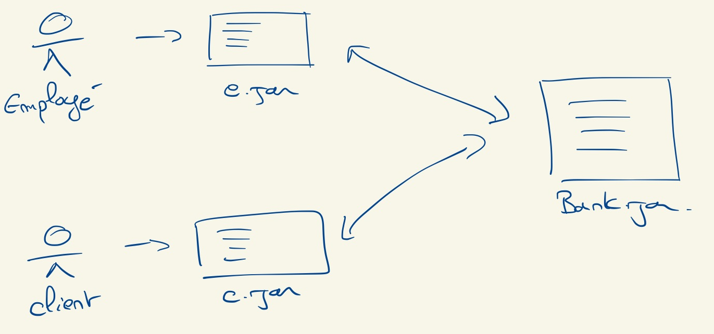

# Projet Technique MGL7460-90 (Hiver 2020)

  * Auteur : Sébastien Mosser (UQAM)
  * Date de publication : Janvier 2020

## Objectifs pédagogiques

Dans ce projet technique à réaliser par équipe de deux, vous êtes responsable de la "réalisation" d'un logiciel de petite envergure. Cette réalisation couvre toutes les phased du développement, du receuil des exigences à la mise en place d'un environnement de déploiement continu pour le projet.

## Contraintes

  - Le développement est effectué en Java;
  - La compilation du projet d'effectue à l'aide de Maven (ou de Gradle), lancé depuis la racine de votre dépôt;
  - Le pipeline d'intégration continue est automatiquement lancé au `push` sur le dépot
  - les scénarios d'acceptations sont implémentés en cucumber.

## Application à développer

On s'interesse à la définition d'un logiciel de gestion de produits bancaires. Un premier module est à destination des employés de la banque, pour créer des comptes clients et gérer ceux-ci. Un second module est destiné aux clients, qui peuvent consulter les produits qu'ils ont dans la banque, et y apporter des modifications. Ces deux modules partagent une dépendance vers le système de la banque.

Les modules des employés et des clients fonctionnent sous la forme d'application en ligne de commande, non interactive. La communication entre les modules est laissée à votre discretion (p.-ex. services REST, RMI, ...).

On ne se préoccupe pas de la sécurité, ni de la persistance. L'objectif est la réalisation de l'application et la mise en place du pipeline de déploiement continu. L'application en elle-même n'est qu'un pretexte, que l'on garde volontairement simpliste.

Les fonctionalités sont données pour les cas _nominaux_. Il est de votre responsabilité de mettre en place de la gestion d'erreur (et de la tester)

### Fonctionalités du module employé

  - `./employee --add CLIENT_NAME`
    - Crée un client de nom `CLIENT_NAME`
  - `./employee --list CLIENT_NAME`
    - Liste les produits attaché au compte de ce client
  - `./employee --accept PRODUCT_ID --client CLIENT_NAME`
    - Accepte la mise en place du produit pour le client
  - `./employee --reject PRODUCT_ID --client CLIENT_NAME`
    - Rejette le produit demandé par le client
  - `./employee --tasks`
    - Liste les clients avec des produits en attente de validation
  - `./employee --upgrade CLIENT_NAME`
    - augmente le statut du client, qui accède à de nouveaux produits
  - `./employee --downgrade CLIENT_NAME`
    - diminue le statut du client, restreignant les produits auxquel il a accès

### Fonctionalités du module client

Plutot que renseigner à chaque invocation son numéro client, on pourrait le stocker dans une variable d'environnement `MGL_CLIENT_NAME`.

  - `./client -n CLIENT_NAME --status`
    - Liste tous les produits du client
  - `./client -n CLIENT_NAME --avail`
    - Liste tous les produits auxquel le client à accès  
  - `./client -n CLIENT_NAME --subscribe PRODUCT_ID`
    - Souscrit à un produit. Si le produit est automatique, la souscription est immediate. Sinon, elle requiert une approbation d'un employé.
  - `./client -n CLIENT_NAME --unsubscribe PRODUCT_ID`
    - Quitte un produit. S'il est impossible de quitter ce produit immédiatement, cela requiert une approbation d'un employé

## Travail à effectuer

  1. Créer un dépôt Git pour le projet (un seul dépôt pour les trois modules)
  2. Mettre en place un système de suivi d'exigences
    - définition de _user stories_  asssociée au projet
    - Estimation des _stories_ en terme de risue technique et de valeur métier
    - les _stories_ doivent être tracée au code via les _commits_
  3. Développement des 3 modules
     - mise en place d'un système de build tenant compte des dépendances
  4. Tests du système
    - tests unitaires pour chaque modules
    - tests d'intégration entre les modules "interface" (employé et client) et le module de la banque
    - scénario d'acceptations pour valider automatiquement les _stories_
  5. Pipeline de déploiement continu
    - au push sur le dépot, lancement des tests, fabrication des images docker, envoi dans le registre.
  6. Mise en place de scénarios de démonstration
    - Démontrant la valeur ajouté du pipeline de déploiement continu pour le dévelopement du produit.

## Livrables

  - `L1` : Produit minimal viable
    * Version minimale du pipeline (push -> tests)
    * au moins une fonctionalités dans chaque module
    * connexion entre modules interface et banque opérationel.
  - `L2`: Produit final.
    * Code + pipeline entièrement opérationel
    * Rapport de 5 pages max (`rapport.pdf` à la racine du dépôt) expliquant les forces et faiblesses de l'application développée et du pipeline.

## Critères d'évaluation

| Thème | Critère        | Poids |
| :---: | :---         | :---: |
| Code | Qualité du code source  | 10% |
| | Qualité communication inter-module | 5% |
| | Qualité du dépôt | 10% |
| | Qualité des tests unitaires & intégration | 10% |
| Exigences | Qualité des _stories_ | 10% |
| | Trace _stories_ <-> code | 5% |
| | Qualité des scénarios d'acceptation | 10% |
| Pipeline | Qualité du pipeline | 15% |
| | Automatisation du déploiement via Docker | 5%  |
| Description | Prise de recul sur le travail effecté | 20% |

  - La partie description est évaluée à l'oral pour le premier livrable, et via le rapport pour le second livrable.
  - si la couverture fonctionelle laisse à désirer, un coefficient de malus pouvant aller jusqu'à 100% sera appliquée à l'évaluation.
